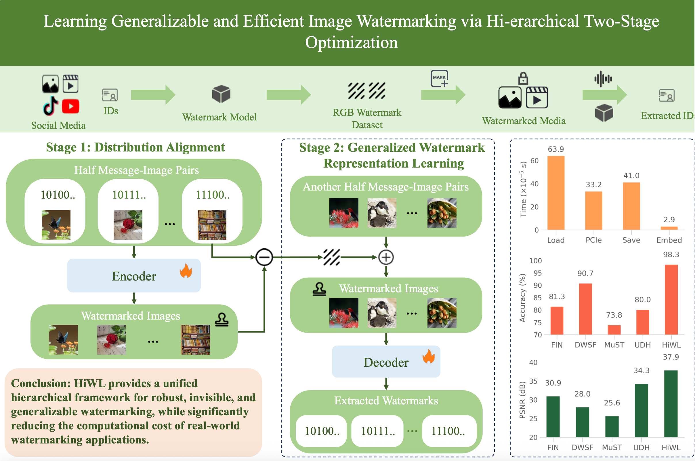

# Learning Generalizable and Efficient Image Watermarking via Hierarchical Two-Stage Optimization

<p align="center">
  <br>
  <em></em>
</p>

HiWL is a two-stage deep image watermarking framework that achieves imperceptible embedding, robust extraction, and high efficiency by aligning multi-modal inputs in a shared latent space and learning generalized watermark representations, outperforming prior methods with +7.6% accuracy while processing 1K small resolution images in 1s.

# Dependencies
## Environment:
  - python=3.9.20
  - pytorch-lightning==2.3.0
  - pytorch==2.0.0+cu117
  - torchvision==0.15.0+cu117
  - numpy==1.26
  - kornia==0.8.2

## Dataset
**Train / Valid / Test**
 - [COCO](https://cocodataset.org/)

**Only Test**
 - [ImageNet](https://www.image-net.org/)
 - [GenImage](https://github.com/GenImage-Dataset/GenImage)
 - [HumanArt](https://github.com/IDEA-Research/HumanArt)
 - [DRCT](https://proceedings.mlr.press/v235/chen24ay.html)

# Usage

## Training
```
# train stage1: 
python train_stage1.py
# train stage2:
python train_stage2.py --load_path 'STAGE1_CHECKPOINT_PATH'
```


## Inference

```
python evaluate.py --path 'MODEL_FOLDER_PATH' --epoch 'EPOCH_NUM' --type 'diff'
```


## Citation
If you find this work useful, please cite our paper:
```
@misc{liu2026learninggeneralizableefficientimage,
      title={Learning Generalizable and Efficient Image Watermarking via Hierarchical Two-Stage Optimization}, 
      author={Ke Liu and Xuanhan Wang and Qilong Zhang and Lianli Gao and Jingkuan Song},
      year={2026},
      eprint={2508.08667},
      archivePrefix={arXiv},
      primaryClass={cs.CV},
      url={https://arxiv.org/abs/2508.08667}, 
}
```